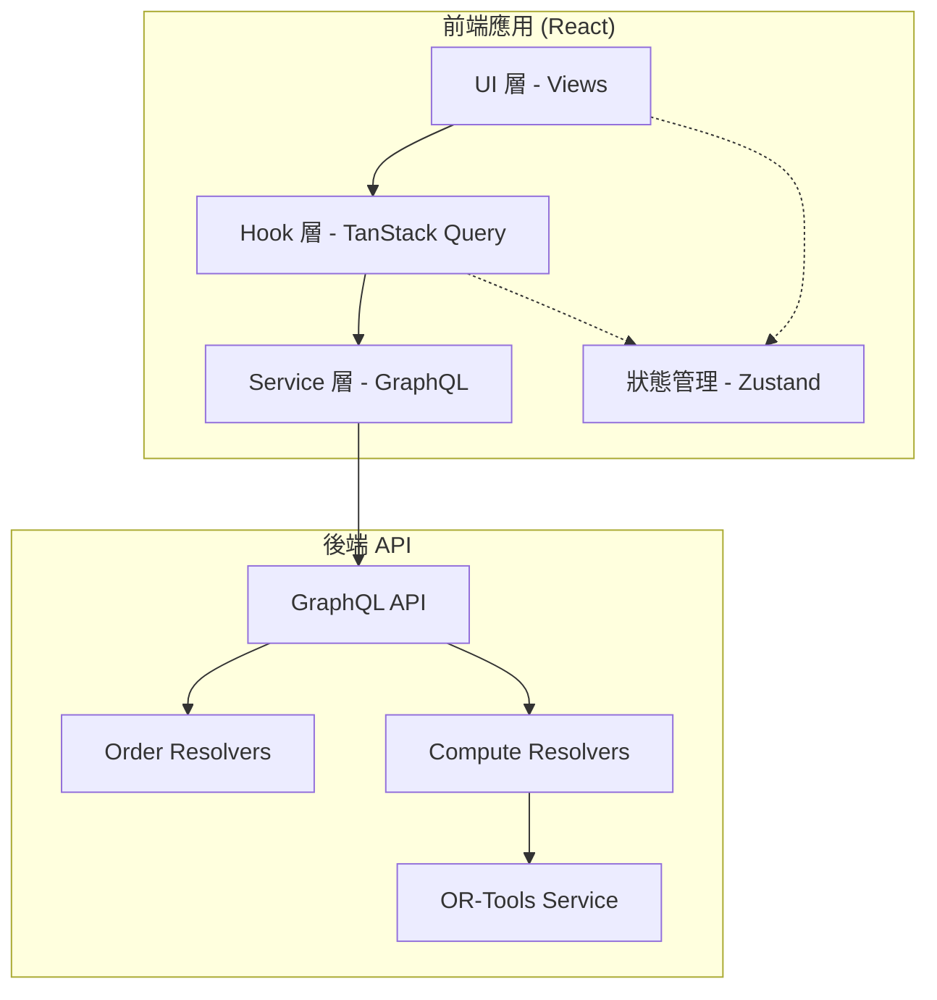
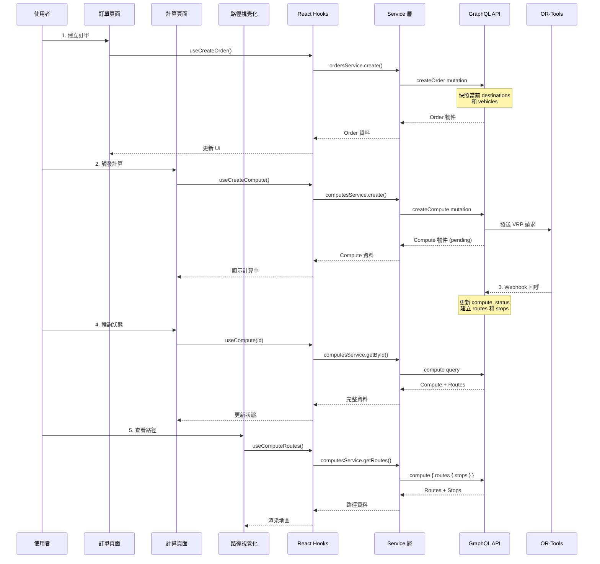

# 設計文件：前端訂單與路徑計算功能整合

## 概述

本功能旨在為現有的前端應用程式新增訂單管理和路徑計算功能。使用者可以建立訂單（快照當前的地點和車輛資料），針對訂單觸發路徑計算任務，並視覺化查看計算結果。整體設計遵循現有的架構模式（Service 層 + Hook 層 + View 層），使用 TanStack Query 管理伺服器狀態，並透過 GraphQL API 與後端通訊。

本設計包含三個主要頁面：訂單管理頁面（Orders）、路徑計算頁面（Computes）、以及路徑視覺化元件（Route Visualization）。所有元件都遵循現有的 UI 設計模式（DaisyUI + Tailwind CSS），並確保與現有功能（地點、車輛、車輛類型管理）的一致性。

## 架構

### 系統架構圖



### 資料流程圖



### 元件結構圖

```mermaid
graph TD
    subgraph "路由層"
        OrdersRoute[/_auth.orders.tsx]
        ComputesRoute[/_auth.computes.tsx]
        ComputeDetailRoute[/_auth.computes.$id.tsx]
    end
    
    subgraph "View 層"
        OrdersView[OrdersView.tsx]
        ComputesView[ComputesView.tsx]
        ComputeDetailView[ComputeDetailView.tsx]
    end
    
    subgraph "元件層"
        OrderFormModal[OrderFormModal.tsx]
        OrderDetailModal[OrderDetailModal.tsx]
        ComputeStatusBadge[ComputeStatusBadge.tsx]
        RouteMap[RouteMap.tsx]
        RouteList[RouteList.tsx]
        RouteStopCard[RouteStopCard.tsx]
    end
    
    subgraph "Hook 層"
        useOrders[useOrders.ts]
        useComputes[useComputes.ts]
    end
    
    subgraph "Service 層"
        ordersService[orders.ts]
        computesService[computes.ts]
    end
    
    OrdersRoute --> OrdersView
    ComputesRoute --> ComputesView
    ComputeDetailRoute --> ComputeDetailView
    
    OrdersView --> OrderFormModal
    OrdersView --> OrderDetailModal
    OrdersView --> useOrders
    
    ComputesView --> ComputeStatusBadge
    ComputesView --> useComputes
    
    ComputeDetailView --> RouteMap
    ComputeDetailView --> RouteList
    RouteList --> RouteStopCard
    ComputeDetailView --> useComputes
    
    useOrders --> ordersService
    useComputes --> computesService
    
    ordersService --> API[GraphQL API]
    computesService --> API
```

## 元件與介面

### 元件 1：訂單管理頁面 (OrdersView)

**目的**：顯示所有訂單列表，提供建立、查看、刪除訂單的功能

**介面**：
```typescript
interface OrdersViewProps {}

// 內部使用的 hooks
const { data: orders, isLoading, error } = useOrders()
const { data: locations } = useLocations()
const { data: vehicles } = useVehicles()
const createOrder = useCreateOrder()
const deleteOrder = useDeleteOrder()
```

**職責**：
- 顯示訂單列表（表格形式）
- 提供「建立訂單」按鈕，開啟 OrderFormModal
- 顯示每個訂單的基本資訊（ID、建立時間、地點數量、車輛數量、狀態）
- 提供「查看詳情」按鈕，開啟 OrderDetailModal
- 提供「刪除訂單」按鈕，確認後刪除
- 提供「前往計算」連結，導向該訂單的計算頁面

### 元件 2：訂單表單 Modal (OrderFormModal)

**目的**：建立新訂單，快照當前的地點和車輛資料

**介面**：
```typescript
interface OrderFormModalProps {
  open: boolean
  onClose: () => void
}
```

**職責**：
- 顯示當前有效的地點列表（唯讀預覽）
- 顯示當前有效的車輛列表（唯讀預覽）
- 提供備註欄位（comment_for_account）
- 提交時呼叫 createOrder，傳入快照資料
- 成功後關閉 modal 並重新整理訂單列表

### 元件 3：訂單詳情 Modal (OrderDetailModal)

**目的**：查看訂單的完整資訊，包括快照的地點和車輛

**介面**：
```typescript
interface OrderDetailModalProps {
  open: boolean
  order: Order | null
  onClose: () => void
}
```

**職責**：
- 顯示訂單基本資訊（ID、建立時間、狀態、備註）
- 顯示快照的地點列表（表格形式）
- 顯示快照的車輛列表（表格形式）
- 顯示該訂單的計算任務數量
- 提供「前往計算」按鈕

### 元件 4：計算任務頁面 (ComputesView)

**目的**：顯示所有計算任務列表，提供觸發新計算的功能

**介面**：
```typescript
interface ComputesViewProps {}

// 內部使用的 hooks
const { data: computes, isLoading } = useComputes()
const { data: orders } = useOrders()
const createCompute = useCreateCompute()
const cancelCompute = useCancelCompute()
```

**職責**：
- 顯示計算任務列表（表格形式）
- 提供「建立計算」按鈕，選擇訂單後觸發計算
- 顯示每個計算任務的狀態（pending, computing, completed, failed, cancelled）
- 提供「查看結果」連結，導向計算詳情頁面
- 提供「取消計算」按鈕（僅限 pending/computing 狀態）
- 支援按訂單篩選計算任務

### 元件 5：計算詳情頁面 (ComputeDetailView)

**目的**：顯示單一計算任務的詳細資訊和路徑結果

**介面**：
```typescript
interface ComputeDetailViewProps {
  computeId: string
}

// 內部使用的 hooks
const { data: compute, isLoading } = useCompute(computeId)
const { data: routes } = useComputeRoutes(computeId)
```

**職責**：
- 顯示計算任務基本資訊（ID、狀態、開始時間、結束時間、失敗原因）
- 顯示關聯的訂單資訊
- 如果狀態為 completed，顯示路徑結果
- 整合 RouteMap 元件顯示地圖
- 整合 RouteList 元件顯示路線列表
- 提供輪詢機制，當狀態為 pending/computing 時自動更新

### 元件 6：路徑地圖 (RouteMap)

**目的**：在地圖上視覺化顯示計算出的路徑

**介面**：
```typescript
interface RouteMapProps {
  routes: Route[]
  destinations: Destination[]
}
```

**職責**：
- 使用 Leaflet 或 Google Maps 顯示地圖
- 在地圖上標記所有地點（不同顏色區分倉庫和配送點）
- 繪製每條路線（不同顏色區分不同車輛）
- 顯示路線方向箭頭
- 點擊地點時顯示詳細資訊（名稱、地址、抵達時間）
- 提供圖層控制，可切換顯示/隱藏特定路線

### 元件 7：路線列表 (RouteList)

**目的**：以列表形式顯示所有路線的詳細資訊

**介面**：
```typescript
interface RouteListProps {
  routes: Route[]
}
```

**職責**：
- 顯示每條路線的摘要資訊（車輛、總距離、總時間、總載重）
- 可展開/收合查看該路線的所有停靠點
- 整合 RouteStopCard 元件顯示停靠點
- 提供排序功能（按距離、時間、載重）

### 元件 8：停靠點卡片 (RouteStopCard)

**目的**：顯示單一停靠點的詳細資訊

**介面**：
```typescript
interface RouteStopCardProps {
  stop: RouteStop
  destination: Destination
}
```

**職責**：
- 顯示停靠順序
- 顯示地點名稱和地址
- 顯示抵達時間（格式化為 HH:mm）
- 顯示需求量
- 提供視覺化指示器（時間軸）

### 元件 9：計算狀態徽章 (ComputeStatusBadge)

**目的**：以視覺化方式顯示計算任務狀態

**介面**：
```typescript
interface ComputeStatusBadgeProps {
  status: ComputeStatus
  className?: string
}

type ComputeStatus = 'pending' | 'computing' | 'completed' | 'failed' | 'cancelled'
```

**職責**：
- 根據狀態顯示不同顏色的徽章
- 顯示對應的中文文字和圖示
- pending: 灰色，等待中
- computing: 藍色，計算中（帶動畫）
- completed: 綠色，已完成
- failed: 紅色，失敗
- cancelled: 橙色，已取消

## 資料模型

### Order（訂單）

```typescript
interface Order {
  id: string
  account_id: number
  status: 'active' | 'deleted'
  data: Record<string, any> | null
  created_at: number
  updated_at: number
  destination_snapshot: DestinationSnapshot[]
  vehicle_snapshot: VehicleSnapshot[]
  comment_for_account: string | null
  computes?: Compute[]
}

interface DestinationSnapshot {
  id: number
  name: string
  address: string
  lat: string
  lng: string
  is_depot?: boolean
  pickup?: number
  delivery?: number
  service_time?: number
  time_window_start?: number
  time_window_end?: number
}

interface VehicleSnapshot {
  id: number
  vehicle_number: string
  capacity: number
  fixed_cost?: number
}
```

**驗證規則**：
- destination_snapshot 必須至少包含 1 個地點
- vehicle_snapshot 必須至少包含 1 輛車輛
- 快照資料必須包含計算所需的所有欄位

### Compute（計算任務）

```typescript
interface Compute {
  id: string
  account_id: number
  order_id: number
  status: 'active' | 'deleted'
  compute_status: ComputeStatus
  start_time: number | null
  end_time: number | null
  fail_reason: string | null
  data: Record<string, any> | null
  created_at: number
  updated_at: number
  comment_for_account: string | null
  routes?: Route[]
}

type ComputeStatus = 'pending' | 'computing' | 'completed' | 'failed' | 'cancelled'
```

**驗證規則**：
- order_id 必須對應到有效的訂單
- compute_status 狀態轉換規則：
  - pending → computing, cancelled
  - computing → completed, failed, cancelled
  - completed, failed, cancelled 為終止狀態

### Route（路線）

```typescript
interface Route {
  id: string
  compute_id: number
  vehicle_id: number
  status: 'active' | 'deleted'
  total_distance: number  // 公尺
  total_time: number      // 分鐘
  total_load: number      // 載重
  created_at: number
  vehicle?: Vehicle
  stops?: RouteStop[]
}
```

**驗證規則**：
- total_distance 必須 >= 0
- total_time 必須 >= 0
- total_load 必須 >= 0 且 <= 車輛容量
- stops 必須按 sequence 排序

### RouteStop（停靠點）

```typescript
interface RouteStop {
  id: string
  route_id: number
  destination_id: number
  sequence: number        // 停靠順序（從 0 開始）
  arrival_time: number    // 抵達時間（分鐘，從 00:00 開始）
  demand: number          // 需求量
  created_at: number
  destination?: Destination
}
```

**驗證規則**：
- sequence 必須 >= 0
- arrival_time 必須在 0-1440 範圍內（一天的分鐘數）
- demand 必須 >= 0

## 錯誤處理

### 錯誤場景 1：建立訂單時無有效地點或車輛

**條件**：使用者嘗試建立訂單，但當前沒有任何有效的地點或車輛

**回應**：
- 在 OrderFormModal 中顯示警告訊息
- 禁用「建立訂單」按鈕
- 提供連結導向地點管理或車輛管理頁面

**復原**：使用者需先建立地點和車輛後才能建立訂單

### 錯誤場景 2：計算任務失敗

**條件**：OR-Tools 計算失敗，或距離矩陣資料不完整

**回應**：
- compute_status 更新為 'failed'
- fail_reason 記錄失敗原因
- 在 ComputesView 和 ComputeDetailView 中顯示失敗狀態
- 顯示失敗原因（如果有）

**復原**：
- 使用者可以重新觸發計算
- 如果是資料問題，需先修正地點或車輛資料

### 錯誤場景 3：查詢不存在的計算任務

**條件**：使用者嘗試查看已刪除或不存在的計算任務

**回應**：
- API 回傳 null
- 前端顯示「計算任務不存在」錯誤訊息
- 提供返回計算列表的按鈕

**復原**：導向計算任務列表頁面

### 錯誤場景 4：網路請求失敗

**條件**：GraphQL API 請求失敗（網路問題、伺服器錯誤）

**回應**：
- TanStack Query 自動重試（最多 3 次）
- 顯示錯誤訊息和「重試」按鈕
- 保持現有資料（如果有快取）

**復原**：使用者點擊「重試」按鈕重新發送請求

### 錯誤場景 5：取消計算任務失敗

**條件**：計算任務已經完成或失敗，無法取消

**回應**：
- API 回傳錯誤訊息
- 前端顯示「無法取消已完成的計算任務」
- 自動重新整理計算任務狀態

**復原**：重新整理頁面，顯示最新狀態

## 測試策略

### 單元測試方法

**Service 層測試**：
- 測試 GraphQL query 和 mutation 的正確性
- 測試資料轉換函數（API 格式 ↔ 前端格式）
- 測試錯誤處理邏輯
- 使用 Mock fetch 模擬 API 回應

**Hook 層測試**：
- 測試 TanStack Query 的 queryKey 正確性
- 測試 mutation 成功後的 cache invalidation
- 測試樂觀更新（如果有）
- 使用 @testing-library/react-hooks

**元件測試**：
- 測試 UI 渲染正確性
- 測試使用者互動（點擊、輸入、提交）
- 測試條件渲染（loading, error, empty state）
- 使用 @testing-library/react

### 屬性測試方法

**屬性測試函式庫**：fast-check

**測試屬性**：

1. **訂單快照完整性**：
   - 屬性：建立訂單時，快照必須包含所有必要欄位
   - 生成器：隨機生成地點和車輛資料
   - 驗證：快照資料可以成功傳遞給 createCompute

2. **計算狀態轉換合法性**：
   - 屬性：計算狀態只能按照允許的路徑轉換
   - 生成器：隨機生成狀態轉換序列
   - 驗證：所有轉換都符合狀態機規則

3. **路線資料一致性**：
   - 屬性：路線的 total_distance, total_time, total_load 必須等於所有停靠點的總和
   - 生成器：隨機生成路線和停靠點資料
   - 驗證：計算總和與 total_* 欄位一致

4. **時間視窗有效性**：
   - 屬性：所有停靠點的 arrival_time 必須在對應地點的時間視窗內
   - 生成器：隨機生成路線資料
   - 驗證：arrival_time 在 time_window_start 和 time_window_end 之間

### 整合測試方法

**端對端流程測試**：
1. 建立訂單 → 觸發計算 → 查看結果（完整流程）
2. 建立訂單 → 刪除訂單（確認關聯的計算任務處理）
3. 觸發計算 → 取消計算（確認狀態更新）

**API 整合測試**：
- 使用真實的 GraphQL API（測試環境）
- 測試所有 query 和 mutation
- 測試錯誤回應處理

## 效能考量

### 輪詢策略

**問題**：計算任務可能需要數秒到數分鐘，需要輪詢狀態更新

**解決方案**：
- 使用 TanStack Query 的 refetchInterval
- 當 compute_status 為 pending 或 computing 時，每 3 秒輪詢一次
- 當狀態變為終止狀態（completed, failed, cancelled）時停止輪詢
- 使用者離開頁面時自動停止輪詢

```typescript
useQuery({
  queryKey: ['compute', computeId],
  queryFn: () => computesService.getById(computeId),
  refetchInterval: (data) => {
    if (!data) return false
    const status = data.compute_status
    return (status === 'pending' || status === 'computing') ? 3000 : false
  }
})
```

### 快取策略

**訂單列表快取**：
- staleTime: 30 秒（訂單資料變動較少）
- cacheTime: 5 分鐘
- 建立/刪除訂單後立即 invalidate

**計算任務快取**：
- staleTime: 0（需要即時狀態）
- cacheTime: 1 分鐘
- 使用 refetchInterval 保持更新

**路線資料快取**：
- staleTime: 5 分鐘（計算完成後不會變動）
- cacheTime: 10 分鐘
- 使用 nested query 一次取得完整資料

### 地圖渲染最佳化

**問題**：大量路線和停靠點可能導致地圖渲染緩慢

**解決方案**：
- 使用 React.memo 避免不必要的重新渲染
- 使用 Leaflet 的 Canvas Renderer（而非 SVG）
- 實作圖層控制，允許使用者隱藏部分路線
- 使用 clustering 處理大量標記點
- 延遲載入地圖（使用者切換到地圖 tab 時才初始化）

### 列表虛擬化

**問題**：大量訂單或計算任務可能導致列表渲染緩慢

**解決方案**：
- 如果列表超過 100 筆，使用 @tanstack/react-virtual
- 實作分頁或無限滾動
- 提供搜尋和篩選功能減少顯示數量

## 安全考量

### 授權檢查

**前端檢查**：
- 所有 API 請求都包含 Authorization header（Bearer token）
- token 儲存在 localStorage
- token 過期時自動導向登入頁面

**後端檢查**：
- 所有 resolver 都使用 requireAuth 檢查使用者身份
- 確保使用者只能存取自己的訂單和計算任務
- 使用 account_id 過濾所有查詢

### 資料驗證

**前端驗證**：
- 表單輸入驗證（必填欄位、格式檢查）
- 快照資料完整性檢查（至少 1 個地點和車輛）
- 使用 TypeScript 確保型別安全

**後端驗證**：
- GraphQL schema 驗證輸入型別
- 業務邏輯驗證（訂單存在性、狀態轉換合法性）
- SQL injection 防護（使用 Drizzle ORM）

### XSS 防護

**措施**：
- React 自動轉義所有輸出
- 使用者輸入的文字（備註、地點名稱）都經過轉義
- 不使用 dangerouslySetInnerHTML
- CSP (Content Security Policy) 設定

## 相依性

### 前端相依性

**現有相依性**（已安裝）：
- react: ^19.0.0
- @tanstack/react-router: ^1.x
- @tanstack/react-query: ^5.x
- zustand: ^5.x
- tailwindcss: ^3.x
- daisyui: ^4.x
- lucide-react: ^0.x（圖示）

**新增相依性**：
- leaflet: ^1.9.x（地圖顯示）
- react-leaflet: ^4.x（React 整合）
- @types/leaflet: ^1.9.x（TypeScript 型別）
- date-fns: ^3.x（時間格式化）

### 後端相依性

**現有 API**：
- Order CRUD（createOrder, orders, order, deleteOrder）
- Compute CRUD（createCompute, computes, compute, cancelCompute）
- Route 和 RouteStop 查詢（透過 Compute.routes 和 Route.stops）

**無需新增**：所有必要的 API 端點都已實作

### 外部服務

**OR-Tools Service**：
- URL: 透過環境變數 ORTOOLS_URL 設定
- 端點: POST /vrp/solve
- 回呼: POST /internal/vrp-callback（後端處理）
- 無需前端直接呼叫


## 正確性屬性

*屬性是指在系統所有有效執行中都應該成立的特徵或行為——本質上是關於系統應該做什麼的正式陳述。屬性作為人類可讀規格與機器可驗證正確性保證之間的橋樑。*

### 屬性 1：訂單快照完整性

*對於任何*訂單建立操作，快照必須包含所有當前有效的地點和車輛資料，且包含計算所需的所有必要欄位（座標、容量、時間視窗等）

**驗證需求：需求 1.1, 1.2, 1.3**

### 屬性 2：訂單建立前置條件

*對於任何*訂單建立請求，如果當前沒有有效的地點或車輛，系統應該拒絕建立並返回明確的錯誤訊息

**驗證需求：需求 1.4, 1.5**

### 屬性 3：使用者資料隔離

*對於任何*查詢操作（訂單或計算任務），返回的結果應該只包含該使用者 account_id 的資料，不包含其他使用者的資料

**驗證需求：需求 2.1, 4.1, 8.2**

### 屬性 4：訂單查詢完整性

*對於任何*訂單查詢操作，返回的訂單資料應該包含完整的快照資料（地點和車輛），且資料結構與建立時一致

**驗證需求：需求 2.2**

### 屬性 5：軟刪除行為

*對於任何*訂單刪除操作，訂單狀態應該更新為 'deleted' 而非實際刪除記錄，且刪除後的訂單不應出現在一般查詢列表中

**驗證需求：需求 2.3**

### 屬性 6：計算任務初始化

*對於任何*計算任務建立操作，系統應該建立狀態為 'pending' 的計算任務，並發送請求到 OR-Tools 服務

**驗證需求：需求 3.1, 3.2**

### 屬性 7：計算狀態機轉換

*對於任何*計算任務狀態轉換，必須遵循以下規則：
- pending 只能轉換到 computing 或 cancelled
- computing 只能轉換到 completed、failed 或 cancelled
- completed、failed、cancelled 為終止狀態，不允許任何轉換

**驗證需求：需求 3.3, 3.4, 9.1, 9.2, 9.3**

### 屬性 8：計算結果處理

*對於任何*來自 OR-Tools 的回呼，如果計算成功，系統應該更新狀態為 'completed' 並建立對應的路線和停靠點資料；如果計算失敗，系統應該更新狀態為 'failed' 並記錄失敗原因

**驗證需求：需求 3.5, 3.6**

### 屬性 9：計算任務查詢完整性

*對於任何*已完成的計算任務查詢，返回的資料應該包含完整的路線和停靠點資訊，以及關聯的訂單資料

**驗證需求：需求 4.2, 4.3**

### 屬性 10：輪詢行為

*對於任何*狀態為 pending 或 computing 的計算任務，前端應該每 3 秒輪詢一次狀態；當狀態變為終止狀態（completed、failed、cancelled）時，應該立即停止輪詢

**驗證需求：需求 4.4, 4.5**

### 屬性 11：地圖視覺化完整性

*對於任何*路線資料集，地圖應該顯示所有地點標記，繪製所有路線並使用不同顏色區分，且點擊任何地點標記應該顯示該地點的詳細資訊

**驗證需求：需求 5.1, 5.2, 5.3**

### 屬性 12：時間格式化一致性

*對於任何*停靠點的 arrival_time（以分鐘為單位），顯示時應該格式化為 HH:mm 格式（例如：480 分鐘顯示為 08:00）

**驗證需求：需求 5.4**

### 屬性 13：路線統計資料一致性

*對於任何*路線，total_distance、total_time 和 total_load 應該分別等於該路線所有停靠點的距離、時間和需求量總和

**驗證需求：需求 6.1, 6.2, 6.3**

### 屬性 14：車輛容量限制

*對於任何*路線，total_load 必須小於或等於該路線所使用車輛的容量

**驗證需求：需求 6.4**

### 屬性 15：時間視窗約束

*對於任何*停靠點，arrival_time 必須在對應地點的時間視窗範圍內（time_window_start 到 time_window_end）

**驗證需求：需求 7.1**

### 屬性 16：停靠點序號連續性

*對於任何*路線的停靠點列表，按 sequence 排序後應該從 0 開始且連續遞增（0, 1, 2, 3, ...）

**驗證需求：需求 7.2**

### 屬性 17：API 請求認證

*對於任何*發送到後端的 API 請求，必須包含有效的 Authorization header（Bearer token 格式）

**驗證需求：需求 8.1**

### 屬性 18：Token 過期處理

*對於任何*收到 401 未授權回應的請求，系統應該清除本地 token 並導向使用者到登入頁面

**驗證需求：需求 8.3**

### 屬性 19：表單驗證

*對於任何*表單提交操作，系統應該驗證所有必填欄位是否已填寫，並在驗證失敗時顯示明確的錯誤訊息

**驗證需求：需求 10.1**

### 屬性 20：網路請求重試機制

*對於任何*失敗的網路請求，系統應該自動重試最多 3 次，並在所有重試失敗後顯示錯誤訊息和手動重試按鈕

**驗證需求：需求 10.2, 10.3**
