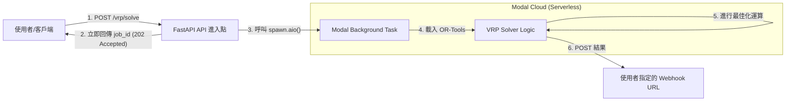

# OR-Tools VRP Solver 專案架構文件

本專案是一個基於 **Google OR-Tools** 與 **Modal** 雲端平台開發的車輛路徑規劃 (VRP) 求解引擎。它採用非同步、Serverless 的架構，專門處理具有複雜約束條件的物流最佳化任務。

---

## 1. 技術棧 (Tech Stack)

- **程式語言**: Python 3.14
- **雲端運算**: [Modal](https://modal.com/) (Serverless GPU/CPU 運算平台)
- **求解核心**: Google OR-Tools (Constraint Programming)
- **API 框架**: FastAPI
- **資料驗證**: Pydantic
- **網路通訊**: HTTPX (用於 Webhook 回傳)

---

## 2. 系統架構圖 (System Architecture)



---

## 3. 目錄結構與模組職責

```text
/
├── src/
│   ├── main.py            # 專案進入點。定義 Modal Image 與 App 配置。
│   ├── local_dev.py       # 本地開發與整合測試腳本。
│   └── vrp/               # 核心邏輯包
│       ├── router.py      # 定義 API 路由 (FastAPI)。
│       ├── schema.py      # Pydantic 資料模型 (Request/Response)。
│       └── solver.py      # 封裝 Google OR-Tools 的路徑規劃演算法。
├── GEMINI.md              # 專案概觀與開發慣例。
└── API_使用說明書.md       # 詳細的 API 規格說明。
```

---

## 4. 核心工作流程 (Workflow)

1.  **請求受理**: 
    - `router.py` 接收到 `VRPRequest`。
    - 驗證矩陣維度（Distance/Time Matrix）是否與地點數量一致。
    - 生成唯一的 `job_id`。
2.  **非同步觸發**: 
    - 使用 `solve_vrp.spawn.aio(job_id, data)` 觸發遠端 Modal 函數。
    - API 立即回應客戶端，不等待運算結果。
3.  **雲端求解**: 
    - Modal 自動配置計算資源（定義於 `main.py` 的 `image` 與 `cpu/memory` 限制）。
    - `solver.py` 執行 `solve_vrp_logic`。
4.  **回報結果**: 
    - 運算成功或失敗（Exception）都會封裝成 JSON payload。
    - 透過 HTTP POST 發送至請求中攜帶的 `webhook_url`。

---

## 5. 求解引擎關鍵約束 (Solver Constraints)

`src/vrp/solver.py` 實作了以下約束：

- **距離成本 (Arc Cost)**: 極小化所有車輛行駛的總距離。
- **容量約束 (Capacity)**: 
    - 基於 Pickup/Delivery 的淨載重計算。
    - 支援每台車輛獨立的載重上限 (`vehicle.capacity`)。
- **時間窗約束 (Time Window)**: 
    - 考慮地點的服務時間 (`service_time`)。
    - 每個地點都有最早抵達與最晚抵達時間限制。
- **固定成本 (Fixed Cost)**: 
    - 只要車輛被啟用，就會計入一次性固定成本，用於優化「使用最少車輛」的需求。

---

## 6. 維護與開發指南

### 啟動服務
```bash
# 本地開發模式 (支援熱重載)
modal serve src/main.py

# 部署到生產環境
modal deploy src/main.py
```

### 修改資源配置
由於 OR-Tools 的 `RoutingModel` (VRP) 搜尋演算法目前主要是 **單執行緒 (Single-threaded)** 運作。因此，增加單一任務的 `cpu` 核心數**並不會加速求解速度**。

若 VRP 規模變大（例如超過 500 個點），請根據以下原則調整 `src/main.py` 中的資源定義：
1.  **優先增加 Memory (記憶體)**：距離與時間矩陣的大小會隨地點數 (N) 的平方增加 ($N^2$)，記憶體不足會導致任務崩潰。
2.  **保持適度 CPU**：設定 `cpu=1.0` 或 `cpu=2.0` 即可滿足單執行緒的算力需求，多餘的 CPU 僅會增加 Modal 的運行成本。

```python
# 範例：針對大規模矩陣增加記憶體
@app.function(cpu=1.0, memory=4096) 
def solve_vrp(job_id: str, data):
    ...
```

### 平行化優勢 (Parallelism)
雖然單一求解任務是單執行緒，但本專案透過 **Modal Serverless 架構** 實現了 **任務級別的平行化 (Task-level Parallelism)**：
*   同時發送 100 個 API 請求時，Modal 會瞬間啟動 100 個獨立容器。
*   每個容器並行處理一個 VRP 問題，這比在單機上開多執行緒更具擴充性與隔離性。

### 延伸功能建議
- **硬性約束與軟性約束**: 目前時間窗為硬性約束，若無解則直接報錯。可考慮引入 `AddDisjunction` 處理可拋棄的地點。
- **多起點/終點**: 目前預設所有車輛從同一個 `depot_index` 出發並返回。
